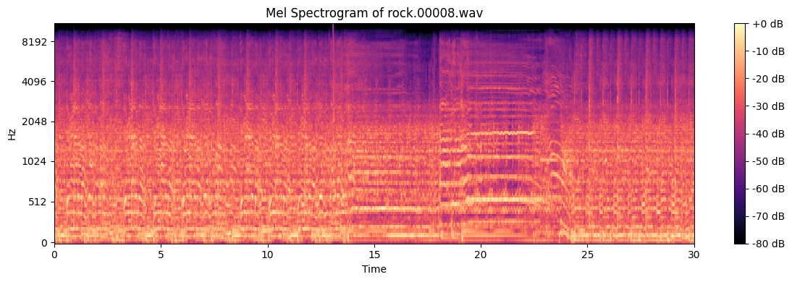
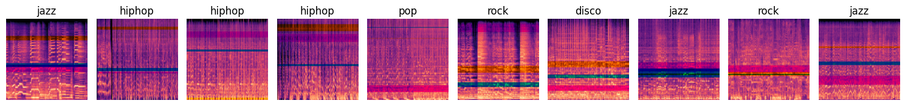

# music-classification-cnn 🎸🎹🎺🎷

A deep learning project leveraging Convolutional Neural Networks to classify audio clips into musical genres.

## Overview

This project aims to classify audio clips into musical genres using Convolutional Neural Networks (CNNs). The dataset used for this project is the [GTZAN dataset](https://www.kaggle.com/datasets/andradaolteanu/gtzan-dataset-music-genre-classification), which consists of 1000 audio clips of 30 seconds each, equally distributed across 10 musical genres. The dataset is divided into 10 folders, each containing 100 audio clips of a particular genre. The audio clips are in .wav format and have a sampling rate of 22050 Hz.

The project was initially developed for the class project of the course "Neural Networks and Deep Learning" at the [University of Pula](https://www.unipu.hr/). The project was later extended to include additional features and improvements.
While the developed models got near perfect accuracy on the training set, the accuracy on the test set was around 50%. This indicates that the models were overfitting the training data. To address this issue, the project was extended to include data augmentation and regularization techniques as well as finetuning and transfer learning using pre-trained models, such as VGG16 and MobileNet.

Final results showed that the best model achieved an accuracy of 80% on the test set for top-2 genre classification. The model was trained on a dataset that was augmented using pitch shifting, time stretching, frequency masking and time masking.

## Mel Spectrogram

Mel spectrogram is a representation of the spectrum of a sound signal as a function of time. It is obtained by applying the Short-Time Fourier Transform (STFT) to the audio signal and then mapping the resulting spectrum to the mel scale. The mel scale is a perceptual scale of pitches that approximates the human ear's response to different frequencies. The mel spectrogram is commonly used in audio processing tasks, such as speech recognition and music classification.

For this project, I generated my own mel spectrograms using the `librosa` library in Python. The mel spectrograms were used as input to the CNN models for genre classification.

- Mel Spectrogram of an audio clip from the GTZAN dataset

- Data Augmentation Techniques applied on spectrogram images
